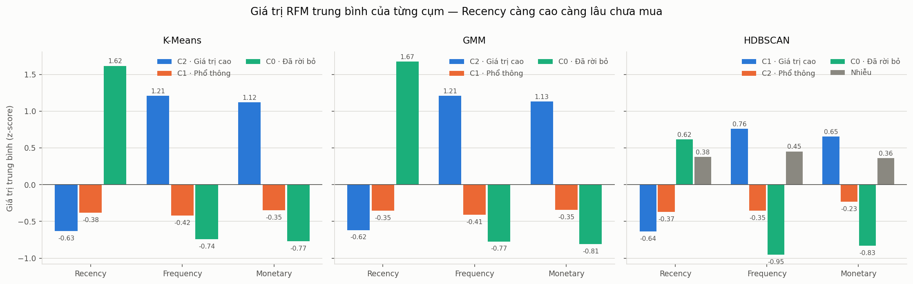
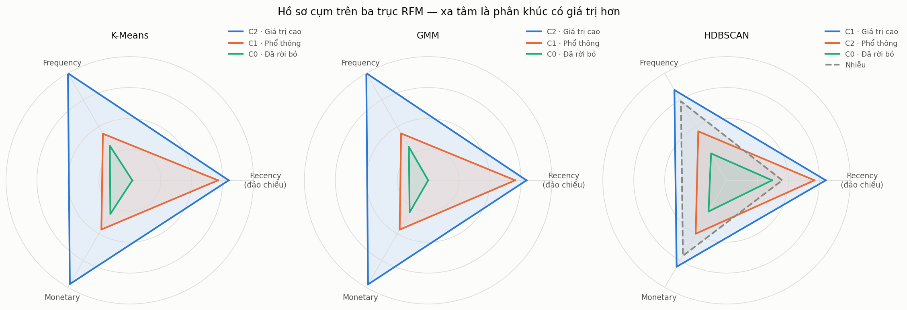
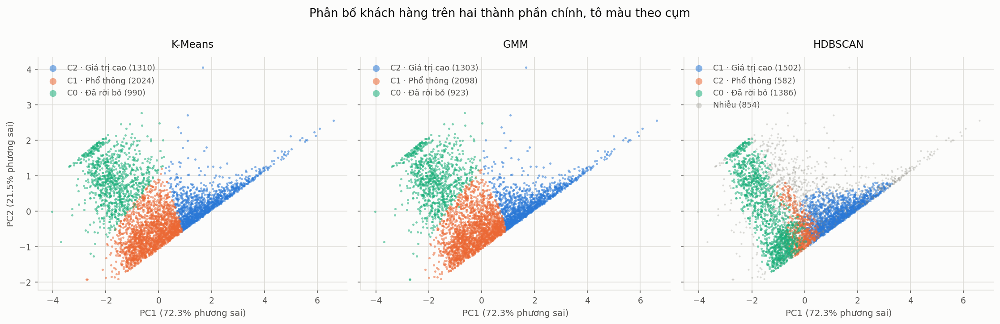

# BÁO CÁO ĐÁNH GIÁ KHẢ NĂNG DIỄN GIẢI VÀ Ý NGHĨA NGHIỆP VỤ CỦA CÁC CỤM

## 1. Tóm tắt kết quả

Báo cáo này trả lời câu hỏi còn lại và cũng là câu hỏi quyết định việc mô hình có dùng được hay không: các cụm mà thuật toán tìm ra có mô tả được bằng ngôn ngữ kinh doanh, có đặt tên được, và có gắn được với một chính sách chăm sóc khách hàng cụ thể hay không.

Ba mô hình được huấn luyện lại trên toàn bộ 4.324 khách hàng bằng cấu hình tốt nhất của Task 12, sau đó mỗi cụm được lập hồ sơ trên thang giá trị RFM gốc và được gán nhãn nghiệp vụ bằng một bộ quy tắc thống nhất.

K-Means và GMM cùng cho ba phân khúc rõ ràng: **Khách hàng giá trị cao** (khoảng 30% số khách hàng nhưng chiếm 81% doanh thu), **Khách hàng phổ thông** (khoảng 47%, chiếm 15% doanh thu) và **Khách hàng đã rời bỏ** (khoảng 23%, chiếm 5% doanh thu). Mức độ phân biệt trung bình giữa các cụm đạt 2,03 độ lệch chuẩn với K-Means và 2,07 với GMM.

HDBSCAN cũng cho ba cụm đặt tên được, nhưng mức độ phân biệt chỉ đạt 1,48 và quan trọng hơn, 854 khách hàng bị gán nhãn nhiễu lại là nhóm đóng góp **54,0% tổng doanh thu**. Nói cách khác, ba phân khúc mà HDBSCAN đặt tên được chỉ bao phủ 80,2% số khách hàng và 46,0% doanh thu. Đây là lý do dứt điểm để không dùng HDBSCAN cho bài toán phân khúc.

---

## 2. Chuẩn bị dữ liệu đầu vào

Thực nghiệm dùng đồng thời hai bảng, mỗi bảng phục vụ một mục đích khác nhau.

| Bảng | Vai trò |
|---|---|
| `data/processed/rfm_scaled.csv` | Huấn luyện mô hình và tính mức độ phân biệt. Ba đặc trưng đã qua biến đổi logarithm và StandardScaler nên nằm trên cùng một thang, so sánh trực tiếp được với nhau |
| `data/processed/rfm_table.csv` | Mô tả cụm bằng đơn vị mà bộ phận kinh doanh đọc được: số ngày, số lần mua và số tiền |

Hai bảng cùng 4.324 dòng và khớp nhau theo thứ tự `CustomerID`, điều này được kiểm tra bằng một câu lệnh assert trước khi phân tích. Cấu hình tối ưu của ba thuật toán được đọc lại từ `outputs/results/clustering_experiments.csv` 

Kết quả gán nhãn của cả ba mô hình được ghép vào một bảng duy nhất, `data/processed/customer_clusters_all_models.csv`, gồm `CustomerID`, ba giá trị RFM gốc và ba cột nhãn cụm. Toàn bộ phân tích phía sau chạy trên bảng này.

| Thuật toán | Cấu hình | Số cụm | Điểm nhiễu |
|---|---|---|---|
| K-Means | `n_clusters = 3` | 3 | 0 |
| GMM | `n_components = 3`, `covariance_type = spherical` | 3 | 0 |
| HDBSCAN | `min_cluster_size = 50`, `min_samples = None` | 3 | 854 |

---

## 3. Hồ sơ cụm khách hàng

### 3.1. K-Means

| Cụm | Số KH | Tỷ trọng | Recency TB | Recency TV | Frequency TB | Frequency TV | Monetary TB | Monetary TV | Monetary SD |
|---|---|---|---|---|---|---|---|---|---|
| 0 | 990 | 22,9% | 254,3 | 252,0 | 1,4 | 1,0 | 400,7 | 282,4 | 518,4 |
| 1 | 2.024 | 46,8% | 54,1 | 45,0 | 2,0 | 2,0 | 601,3 | 501,4 | 477,7 |
| 2 | 1.310 | 30,3% | 29,1 | 17,0 | 9,8 | 7,0 | 5.114,4 | 2.498,0 | 14.597,5 |

### 3.2. GMM

| Cụm | Số KH | Tỷ trọng | Recency TB | Recency TV | Frequency TB | Frequency TV | Monetary TB | Monetary TV | Monetary SD |
|---|---|---|---|---|---|---|---|---|---|
| 0 | 923 | 21,3% | 260,2 | 257,0 | 1,3 | 1,0 | 371,7 | 266,5 | 401,9 |
| 1 | 2.098 | 48,5% | 56,9 | 46,0 | 2,1 | 2,0 | 597,6 | 501,1 | 446,7 |
| 2 | 1.303 | 30,1% | 30,5 | 17,0 | 9,8 | 7,0 | 5.154,7 | 2.526,2 | 14.631,8 |

Hồ sơ ba cụm của GMM trùng khớp với K-Means đến mức gần như không phân biệt được: chênh lệch Recency trung bình lớn nhất là 5,9 ngày, Frequency trung bình chênh không quá 0,1 lần, Monetary trung bình chênh không quá 41. Điều này thống nhất với ARI 0,9306 giữa hai mô hình đã đo với kết quả độ ổn định ngang nhau.

### 3.3. HDBSCAN

| Cụm | Số KH | Tỷ trọng | Recency TB | Recency TV | Frequency TB | Frequency TV | Monetary TB | Monetary TV | Monetary SD |
|---|---|---|---|---|---|---|---|---|---|
| -1 (nhiễu) | 854 | 19,8% | 130,2 | 123,5 | 7,8 | 3,0 | 5.260,1 | 1.056,2 | 18.153,6 |
| 0 | 1.386 | 32,1% | 154,1 | 128,0 | 1,0 | 1,0 | 302,8 | 251,8 | 206,2 |
| 1 | 1.502 | 34,7% | 28,4 | 21,0 | 6,1 | 5,0 | 2.035,5 | 1.572,8 | 1.508,0 |
| 2 | 582 | 13,5% | 55,0 | 39,0 | 2,0 | 2,0 | 591,7 | 558,5 | 286,1 |

Nhóm nhiễu cần được đọc kỹ. Giá trị trung bình của nó (Monetary 5.260,1, Frequency 7,8) cao hơn cả cụm tốt nhất mà HDBSCAN tìm được, nhưng trung vị lại chỉ là 1.056,2 và 3,0, còn độ lệch chuẩn Monetary lên tới 18.153,6. Khoảng cách rất lớn giữa trung bình và trung vị cho thấy nhóm này không phải một nhóm khách hàng có hành vi chung, mà là tập hợp của những khách hàng ở mọi vùng biên: vừa có nhóm chi tiêu cực lớn, vừa có nhóm mua thưa thớt bất thường. Mục 6.2 phân tích hệ quả nghiệp vụ của việc này.

### 3.4. Ghi chú về độ lệch chuẩn của Monetary

Ở cả ba mô hình, cụm giá trị cao đều có độ lệch chuẩn Monetary rất lớn so với trung bình (K-Means: 14.597,5 so với 5.114,4). Điều này đã được ghi nhận ở mục 6.5 của báo cáo Task 12: bên trong nhóm giá trị cao vẫn còn một số ít khách hàng chi tiêu vượt trội. Đây là đặc điểm của dữ liệu bán lẻ chứ không phải lỗi phân cụm, nhưng nó có nghĩa là khi triển khai chính sách cho nhóm này, giá trị trung vị (2.498,0) mới là con số đại diện cho khách hàng điển hình, không phải giá trị trung bình.

---

## 4. Đánh giá khả năng diễn giải

### 4.1. Sự khác biệt về đặc trưng RFM giữa các cụm

Bảng dưới là giá trị trung bình của từng đặc trưng đã chuẩn hóa theo từng cụm. Số 0 là mức trung bình của toàn bộ khách hàng, đơn vị là độ lệch chuẩn. Với Recency, giá trị càng lớn nghĩa là lần mua gần nhất càng xa, tức càng xấu.

| Mô hình | Cụm | Recency | Frequency | Monetary |
|---|---|---|---|---|
| K-Means | 0 | 1,616 | -0,744 | -0,768 |
| K-Means | 1 | -0,382 | -0,419 | -0,349 |
| K-Means | 2 | -0,631 | 1,209 | 1,120 |
| GMM | 0 | 1,674 | -0,773 | -0,809 |
| GMM | 1 | -0,353 | -0,412 | -0,345 |
| GMM | 2 | -0,617 | 1,210 | 1,129 |
| HDBSCAN | -1 | 0,377 | 0,453 | 0,360 |
| HDBSCAN | 0 | 0,615 | -0,951 | -0,833 |
| HDBSCAN | 1 | -0,638 | 0,758 | 0,655 |
| HDBSCAN | 2 | -0,373 | -0,355 | -0,234 |

Với K-Means và GMM, ba cụm xếp thành một trật tự nhất quán trên cả ba đặc trưng: cụm 0 xấu nhất ở cả ba chiều, cụm 2 tốt nhất ở cả ba chiều, cụm 1 nằm giữa. Trật tự nhất quán này chính là điều làm cho cụm dễ diễn giải, vì có thể mô tả từng nhóm bằng một câu duy nhất mà không cần nêu ngoại lệ.

Với HDBSCAN, ba cụm cũng xếp theo trật tự tương tự nhưng biên độ hẹp hơn hẳn, và nhóm nhiễu chen vào giữa: nó có Recency xấu (0,377) nhưng Frequency và Monetary lại tốt (0,453 và 0,360), không nằm ở đầu nào của trật tự.

### 4.2. Mức độ phân biệt của cụm

$$\Delta_j = \frac{\max_k(\bar{x}_{kj}) - \min_k(\bar{x}_{kj})}{\sigma_j}$$

Vì dữ liệu đã chuẩn hóa nên `σ_j = 1`, và `Δ_j` đọc trực tiếp được là khoảng cách giữa cụm cao nhất và cụm thấp nhất tính theo số độ lệch chuẩn. Các điểm nhiễu không tham gia phép tính vì nhiễu không phải một cụm.

| Model | Δ Recency | Δ Frequency | Δ Monetary | Δ trung bình | Δ nhỏ nhất |
|---|---|---|---|---|---|
| GMM | **2,291** | **1,983** | **1,939** | **2,071** | **1,939** |
| K-Means | 2,246 | 1,953 | 1,888 | 2,029 | 1,888 |
| HDBSCAN | 1,253 | 1,708 | 1,487 | 1,483 | 1,253 |

Cả ba đặc trưng RFM đều đóng góp vào việc phân biệt các cụm, không có đặc trưng nào thừa. Với K-Means và GMM, đặc trưng yếu nhất là Monetary vẫn đạt gần 1,9 độ lệch chuẩn, đủ lớn để khác biệt giữa các cụm là khác biệt thực chứ không phải dao động ngẫu nhiên.

Recency là đặc trưng phân biệt mạnh nhất ở K-Means và GMM (2,25 và 2,29), phù hợp với hồ sơ cụm ở mục 3: khoảng cách giữa 254 ngày và 29 ngày là khác biệt dễ thấy nhất giữa các nhóm.

HDBSCAN thấp hơn ở cả ba đặc trưng, và thấp nhất ở Recency (1,253, chỉ bằng 56% của K-Means). Nguyên nhân đọc được từ hồ sơ cụm: cụm 0 của HDBSCAN có Recency trung bình 154 ngày trong khi cụm rời bỏ của K-Means là 254 ngày. HDBSCAN không tách được nhóm rời bỏ triệt để vì phần lớn khách hàng rời bỏ lâu nhất đã bị đẩy sang nhóm nhiễu.

### 4.3. Trực quan hóa

Ba biểu đồ dùng chung quy ước màu theo **phân khúc nghiệp vụ**, không theo số hiệu cụm. Số hiệu cụm do thuật toán tự sinh, nên cụm 2 của K-Means và cụm 1 của HDBSCAN cùng là nhóm giá trị cao; nếu tô màu theo số hiệu thì ba biểu đồ sẽ không so sánh được với nhau. Màu xám dành riêng cho nhiễu vì đó không phải một phân khúc.

**Bar chart — giá trị RFM trung bình của từng cụm**

Ba đặc trưng dùng chung một trục z-score nên so sánh trực tiếp được, không cần trục thứ hai. Hai bảng đầu (K-Means, GMM) gần như trùng khít nhau. Ở bảng HDBSCAN, các cột thấp hơn hẳn — đó chính là mức độ phân biệt 1,48 so với 2,03 — và cột xám của nhóm nhiễu dương ở cả Frequency lẫn Monetary, tức nhóm bị loại ra lại có hành vi mua tốt hơn mức trung bình.

**Radar chart — hồ sơ cụm**

Recency được đảo chiều để cả ba trục cùng hướng "xa tâm là tốt hơn", nên diện tích đa giác đọc được như mức độ giá trị của phân khúc. Với K-Means và GMM, ba đa giác lồng vào nhau gọn gàng, thể hiện đúng ba bậc giá trị. Với HDBSCAN, đa giác nét đứt của nhóm nhiễu cắt qua hai đa giác còn lại thay vì nằm gọn bên trong — bằng chứng trực quan cho thấy nhiễu không phải phần dư giá trị thấp mà là một nhóm có giá trị cao bị bỏ sót.

**PCA 2D — phân bố khách hàng**

Hai thành phần chính giữ lại 93,8% phương sai (PC1 72,3%, PC2 21,5%) nên hình chiếu này phản ánh khá trung thực cấu trúc dữ liệu gốc. PC1 có trọng số -0,484 với Recency, +0,623 với Frequency và +0,615 với Monetary, tức PC1 chính là trục giá trị khách hàng: càng sang phải càng mua nhiều, mua gần đây và chi tiêu lớn. PC2 chủ yếu mang thông tin Recency (trọng số 0,874).

K-Means và GMM chia mặt phẳng thành ba vùng liền mạch, ranh giới rõ và hai hình gần như giống hệt nhau. HDBSCAN cho hình khác hẳn: các điểm xám rải khắp mặt phẳng kể cả trong vùng dày đặc bên phải, và cụm phổ thông (màu cam) bị ép thành một dải mỏng kẹp giữa hai cụm còn lại. Đây là biểu hiện trực quan của ARI 0,2083 giữa HDBSCAN và K-Means.

---

## 5. Ý nghĩa nghiệp vụ của từng phân khúc

### 5.1. Quy tắc gán nhãn

Nhãn nghiệp vụ được gán bằng quy tắc trên z-score trung bình của cụm chứ không gán tay, để cùng một hồ sơ hành vi luôn nhận cùng một tên ở cả ba mô hình và để việc gán nhãn tái lập được khi dữ liệu cập nhật. Trục giá trị `value_z` là trung bình của Frequency và Monetary; Recency giữ nguyên chiều nên giá trị càng lớn nghĩa là càng lâu chưa mua.

| Điều kiện | Phân khúc |
|---|---|
| `cluster = -1` | Chưa phân khúc (nhiễu) |
| `recency_z ≥ 0,5` và `value_z ≥ 0,5` | Khách hàng giá trị cao có nguy cơ rời bỏ |
| `recency_z ≥ 0,5` | Khách hàng đã rời bỏ |
| `value_z ≥ 0,5` | Khách hàng giá trị cao |
| còn lại | Khách hàng phổ thông |

Ngưỡng 0,5 độ lệch chuẩn được chọn vì nó tách được ba cụm của K-Means và GMM mà không cần điều chỉnh riêng cho từng mô hình. Bộ quy tắc bao phủ đủ bốn trường hợp của hai trục; phân khúc "giá trị cao có nguy cơ rời bỏ" không xuất hiện trong dữ liệu hiện tại nhưng được giữ lại vì nó có thể xuất hiện khi dữ liệu thay đổi, và đó cũng là nhóm cần cảnh báo sớm nhất nếu xuất hiện.

### 5.2. Ba phân khúc của mô hình được chọn

| Phân khúc | Cụm | Số KH | Tỷ trọng KH | Tỷ trọng doanh thu | Hành vi đặc trưng | Chiến lược chăm sóc |
|---|---|---|---|---|---|---|
| **Khách hàng giá trị cao** | 2 | 1.310 | 30,3% | **80,6%** | Mua cách đây 29 ngày, gần 10 lần mua, chi tiêu trung bình 5.114 (trung vị 2.498) | Giữ chân: ưu đãi riêng, chăm sóc chủ động, ưu tiên nguồn lực |
| **Khách hàng phổ thông** | 1 | 2.024 | 46,8% | 14,6% | Mua cách đây 54 ngày, khoảng 2 lần mua, chi tiêu trung bình 601 | Tăng giá trị: gợi ý mua kèm, chương trình tích điểm để nâng tần suất |
| **Khách hàng đã rời bỏ** | 0 | 990 | 22,9% | 4,8% | Mua cách đây hơn 8 tháng, gần như chỉ mua 1 lần, chi tiêu trung bình 401 | Kích hoạt lại: chiến dịch win-back, hoặc loại khỏi danh sách tiếp thị |

Cả ba phân khúc đều thỏa mãn ba điều kiện của một cụm có ý nghĩa nghiệp vụ: có đặc điểm hành vi rõ ràng, đặt tên được bằng một nhóm khách hàng cụ thể, và gắn được với một chiến lược chăm sóc riêng.

Con số đáng chú ý nhất là độ lệch giữa tỷ trọng khách hàng và tỷ trọng doanh thu. Nhóm giá trị cao chiếm 30,3% số khách hàng nhưng tạo ra 80,6% doanh thu, còn hai nhóm còn lại gộp lại chiếm 69,7% số khách hàng nhưng chỉ tạo ra 19,4%. Đây là căn cứ định lượng để phân bổ ngân sách chăm sóc khách hàng, và nó chỉ đọc được sau khi có phân khúc — bảng RFM thô không cho biết điều này.

Nhóm phổ thông là nhóm đông nhất (46,8%) và cũng là nhóm có dư địa lớn nhất: họ vẫn đang hoạt động (54 ngày kể từ lần mua gần nhất) nhưng mới mua khoảng 2 lần. Chênh lệch giữa nhóm này và nhóm giá trị cao chủ yếu nằm ở Frequency (2,0 so với 9,8) chứ không ở Recency, nên chính sách hợp lý là nâng tần suất mua chứ không phải kích hoạt lại.

### 5.3. Đối chiếu với GMM

Ba phân khúc của GMM mang cùng tên gọi, cùng thứ tự và quy mô chênh không quá 1,7 điểm phần trăm so với K-Means (30,1% so với 30,3%, 48,5% so với 46,8%, 21,3% so với 22,9%). Tỷ trọng doanh thu của nhóm giá trị cao là 80,8% so với 80,6%. Với mục đích nghiệp vụ, hai mô hình cho cùng một kết quả.

---

## 6. So sánh khả năng diễn giải giữa ba thuật toán

### 6.1. Bảng tổng hợp

| Model | Δ trung bình | Δ nhỏ nhất | Số phân khúc đặt tên được | Tỷ lệ KH được phân khúc | Tỷ lệ doanh thu được phân khúc |
|---|---|---|---|---|---|
| **K-Means** | 2,029 | 1,888 | 3 | **100%** | **100%** |
| GMM | **2,071** | **1,939** | 3 | **100%** | **100%** |
| HDBSCAN | 1,483 | 1,253 | 3 | 80,2% | 46,0% |

GMM nhỉnh hơn K-Means một chút về mức độ phân biệt (2,071 so với 2,029). Đây là lần thứ ba trong ba task liên tiếp mà GMM và K-Means cho kết quả gần như trùng nhau: Silhouette chênh 0,0001, Mean ARI chênh 0,0004, và Δ trung bình chênh 0,042. Chênh lệch này không đủ để thay đổi lựa chọn mô hình, và mục 6.4 của báo cáo Task 12 đã nêu căn cứ chọn K-Means là khả năng diễn giải của tâm cụm.

### 6.2. Vấn đề của HDBSCAN

Ba cụm của HDBSCAN đều đặt tên được, nên xét riêng tiêu chí "có đặt tên được hay không" thì HDBSCAN không thua. Vấn đề nằm ở phần dữ liệu mà ba cụm đó không bao phủ.

| Nhóm nhiễu của HDBSCAN | Giá trị |
|---|---|
| Số khách hàng | 854 (19,8%) |
| Doanh thu đóng góp | 4.492.154 (**54,0%** tổng doanh thu) |
| Monetary trung bình | 5.260,1 |
| Monetary trung vị | 1.056,2 |
| Monetary độ lệch chuẩn | 18.153,6 |
| Frequency trung bình / trung vị | 7,8 / 3,0 |

Nhóm bị HDBSCAN loại ra khỏi mọi phân khúc chiếm một phần năm số khách hàng nhưng lại nắm hơn một nửa doanh thu. Trong 854 khách hàng này có 314 người mà K-Means xếp vào nhóm giá trị cao. Nếu dùng HDBSCAN để phân khúc, doanh nghiệp sẽ không có chính sách nào cho nhóm khách hàng quan trọng nhất của mình.

Khoảng cách giữa Monetary trung bình (5.260,1) và trung vị (1.056,2) cho thấy nhóm nhiễu cũng không phải một phân khúc trá hình có thể đặt tên lại. Nó trộn lẫn khách hàng chi tiêu cực lớn với khách hàng mua thưa thớt bất thường, hai nhóm cần hai chính sách trái ngược nhau. Vì vậy không thể xử lý bằng cách đơn giản là gọi nhóm nhiễu là "phân khúc thứ tư".

Ngoài ra, cụm 2 của HDBSCAN chỉ có 582 khách hàng (13,5%) và đóng góp 4,1% doanh thu, trong khi hồ sơ của nó (Recency 55,0, Frequency 2,0, Monetary 591,7) gần như trùng với nhóm phổ thông của K-Means (54,1, 2,0, 601,3) vốn có 2.024 khách hàng. HDBSCAN đã xé nhóm phổ thông ra làm nhiều mảnh: trong 2.024 khách hàng mà K-Means xếp vào nhóm phổ thông, HDBSCAN chia thành 735 người ở cụm 0, 506 ở cụm 1, 551 ở cụm 2 và 232 bị gán nhiễu. Một nhóm khách hàng có hành vi đồng nhất bị chia làm bốn phần là dấu hiệu rõ của khả năng diễn giải kém.

### 6.3. Mô hình được chọn

**K-Means với `n_clusters = 3`**
Bảng dưới tổng hợp ba tiêu chí đã đo

| Tiêu chí | K-Means | GMM | HDBSCAN |
|---|---|---|---|---|
| Chất lượng phân cụm (Silhouette) | 0,4143 | 0,4144 | 0,2028 |
| Độ ổn định (Mean ARI) | 0,9751 | 0,9747 | 0,9543 |
| Mức độ phân biệt (Δ trung bình) | 2,029 | 2,071 | 1,483 |
| Tỷ lệ doanh thu được phân khúc | 100% | 100% | 46,0% |

Ba tiêu chí đầu cho thấy K-Means và GMM tương đương nhau và cùng vượt HDBSCAN. Tiêu chí cuối là tiêu chí duy nhất có khoảng cách mang tính quyết định, và nó loại HDBSCAN khỏi bài toán này.

---

## 7. Hạn chế của phân tích

Thứ nhất, nhãn nghiệp vụ được gán bằng quy tắc ngưỡng trên z-score, và ngưỡng 0,5 là một lựa chọn của người phân tích chứ không suy ra từ dữ liệu. Với ba cụm tách bạch như hiện tại, kết quả gán nhãn không nhạy với ngưỡng vì các cụm nằm cách xa ngưỡng. Nhưng nếu về sau dùng số cụm lớn hơn, các cụm sẽ nằm sát nhau hơn và lựa chọn ngưỡng sẽ bắt đầu ảnh hưởng tới tên gọi.

Thứ hai, khả năng diễn giải được đo bằng một chỉ số duy nhất là Δ, tức khoảng cách giữa cụm cao nhất và cụm thấp nhất. Chỉ số này không phản ánh việc các cụm ở giữa có tách biệt với nhau hay không. Với ba cụm thì hạn chế này nhỏ, nhưng với số cụm lớn hơn thì Δ có thể cao trong khi các cụm ở giữa chồng lấn nhau.

Thứ ba, phân khúc chỉ dựa trên ba đặc trưng RFM. Các thông tin có thể làm phân khúc giàu ý nghĩa hơn về mặt nghiệp vụ — ngành hàng đã mua, kênh mua, khu vực địa lý — chưa được đưa vào. Kết quả hiện tại mô tả *mức độ* gắn bó của khách hàng chứ chưa mô tả *loại* nhu cầu của họ.

Thứ tư, các chiến lược chăm sóc ở mục 5.2 là đề xuất suy ra từ hồ sơ hành vi, chưa được kiểm chứng bằng thực nghiệm kinh doanh. Việc nhóm giá trị cao đáng được ưu tiên nguồn lực là kết luận có căn cứ từ số liệu doanh thu, nhưng hình thức ưu đãi cụ thể nào hiệu quả thì cần A/B test để trả lời.
