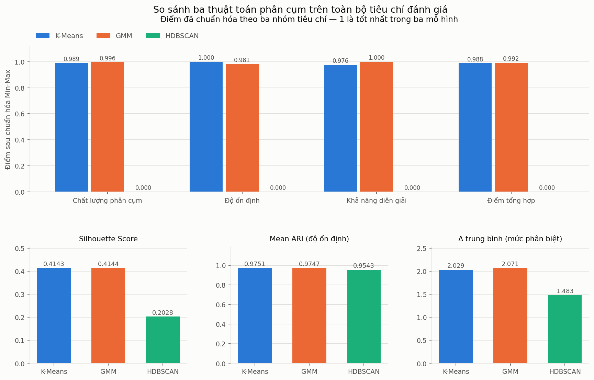

# BÁO CÁO SO SÁNH TỔNG HỢP CÁC THUẬT TOÁN PHÂN CỤM

## 1. Tóm tắt kết quả

Báo cáo này gộp kết quả của ba lần đánh giá độc lập trước đó — chất lượng phân cụm, độ ổn định, khả năng diễn giải và ý nghĩa nghiệp vụ — vào một khung so sánh duy nhất, chuẩn hóa các chỉ số về cùng một thang và phân tích sự đánh đổi giữa ba thuật toán.

Kết luận chính là **không có thuật toán nào vượt trội trên tất cả tiêu chí**, đúng với trường hợp mà tài liệu đặc tả đã dự liệu. Cụ thể hơn:

- K-Means và GMM ngang nhau đến mức không phân biệt được. Điểm tổng hợp của GMM là 0,9923 và của K-Means là 0,9883, chênh 0,0040. Khoảng chênh này nhỏ hơn sai số đo của chính các chỉ số cấu thành nó, và thứ hạng đảo chiều khi thay đổi trọng số giữa ba nhóm tiêu chí.
- HDBSCAN nhận điểm 0 ở cả ba nhóm, nhưng phần lớn con số 0 đó là hệ quả của phép chuẩn hóa Min-Max trên ba mô hình chứ không phải đánh giá tuyệt đối. Lý do thực sự để loại HDBSCAN là một ràng buộc nghiệp vụ duy nhất: ba cụm của nó chỉ bao phủ 46,0% doanh thu.

Vì hai mô hình dẫn đầu hòa nhau trên mọi tiêu chí đo được, quyết định cuối cùng dựa trên hai tiêu chí mà điểm tổng hợp không mã hóa được: khả năng diễn giải của cách mô tả mô hình và yêu cầu gán cứng phân khúc trong bối cảnh CRM. Trên hai tiêu chí đó, mô hình được chọn là **K-Means với `n_clusters = 3`**.

---

## 2. Nguồn dữ liệu đầu vào

Báo cáo này không huấn luyện lại mô hình. Toàn bộ số liệu được đọc lại từ kết quả đã lưu của task trước, nên mọi con số ở đây truy ngược được về đúng thực nghiệm đã sinh ra nó.

| Nhóm tiêu chí | Nguồn | 
|---|---|
| Chất lượng phân cụm | `outputs/results/clustering_experiments.csv` | 
| Độ ổn định | `data/processed/stability_results.csv` | 
| Mức độ phân biệt của cụm | `outputs/results/cluster_separation.csv` | 
| Ý nghĩa nghiệp vụ | `data/processed/cluster_profiles.csv` | 

Với bảng thực nghiệm, cấu hình được lấy là cấu hình có Silhouette cao nhất của mỗi thuật toán.

| Thuật toán | Cấu hình |
|---|---|
| K-Means | `n_clusters = 3` |
| GMM | `n_components = 3`, `covariance_type = spherical` |
| HDBSCAN | `min_cluster_size = 50`, `min_samples = None` |

---

## 3. Kết quả gốc của ba nhóm tiêu chí

### 3.1. Chất lượng phân cụm

| Model | Silhouette ↑ | Davies-Bouldin ↓ | Calinski-Harabasz ↑ |
|---|---|---|---|
| K-Means | 0,4143 | 0,8293 | **4.389,6** |
| GMM | **0,4144** | **0,8167** | 4.364,7 |
| HDBSCAN | 0,2028 | 1,1956 | 2.404,6 |

Ba chỉ số không cùng chỉ về một mô hình: GMM tốt hơn ở Silhouette và DBI, K-Means tốt hơn ở CHI. Riêng chênh lệch Silhouette là 0,0001, tức nhỏ hơn bốn bậc so với chênh lệch giữa hai mô hình này và HDBSCAN (0,2116).

Cần lưu ý chỉ số của HDBSCAN được tính sau khi loại 854 điểm nhiễu, tức trên một tập con dễ hơn, nên khoảng cách thực tế còn lớn hơn con số trong bảng.

### 3.2. Độ ổn định

| Model | Mean ARI ↑ | Std ARI ↓ | Kết luận |
|---|---|---|---|
| K-Means | **0,9751** | **0,0136** | Rất ổn định |
| GMM | 0,9747 | 0,0143 | Rất ổn định |
| HDBSCAN | 0,9543 | 0,0506 | Ổn định |

K-Means dẫn đầu ở cả hai chỉ số nhưng khoảng cách với GMM là 0,0004 ở Mean ARI, trong khi Std ARI của chính mỗi mô hình là khoảng 0,014. Nói cách khác, khoảng cách giữa hai mô hình nhỏ hơn 3% biến động nội tại của phép đo.

### 3.3. Khả năng diễn giải và ý nghĩa nghiệp vụ

| Model | Số cụm | Điểm nhiễu | Δ trung bình ↑ | Số phân khúc đặt tên được | Tỷ lệ KH được phân khúc | Tỷ lệ doanh thu được phân khúc |
|---|---|---|---|---|---|---|
| K-Means | 3 | 0 | 2,029 | 3 | **100%** | **100%** |
| GMM | 3 | 0 | **2,071** | 3 | **100%** | **100%** |
| HDBSCAN | 3 | 854 | 1,483 | 3 | 80,2% | 46,0% |

Cả ba thuật toán đều cho 3 cụm và cả ba đều đặt tên nghiệp vụ được cho các cụm của mình. Khác biệt nằm ở hai chỗ: mức độ phân biệt giữa các cụm, và phần dữ liệu mà các cụm bao phủ.

---

## 4. Chuẩn hóa các tiêu chí

### 4.1. Phương pháp

Tám chỉ số được chuẩn hóa Min-Max về thang [0, 1] theo hướng "càng lớn càng tốt". Ba chỉ số cần tối thiểu — Davies-Bouldin, Std ARI và số điểm nhiễu — được đảo dấu trước khi chuẩn hóa. Khi cả ba mô hình có cùng giá trị, cả ba cùng nhận điểm 1.

| Chỉ số | Hướng tối ưu | Nhóm |
|---|---|---|
| Silhouette Score | tối đa | Chất lượng phân cụm |
| Davies-Bouldin Index | tối thiểu | Chất lượng phân cụm |
| Calinski-Harabasz Index | tối đa | Chất lượng phân cụm |
| Mean ARI | tối đa | Độ ổn định |
| Std ARI | tối thiểu | Độ ổn định |
| Δ trung bình | tối đa | Khả năng diễn giải |
| Số điểm nhiễu | tối thiểu | Khả năng diễn giải |
| Tỷ lệ doanh thu được phân khúc | tối đa | Khả năng diễn giải |

Số điểm nhiễu và tỷ lệ doanh thu được phân khúc được xếp vào nhóm khả năng diễn giải vì cả hai đo cùng một thứ: phần khách hàng mà mô hình thực sự mô tả được. Hai chỉ số này không trùng nhau — điểm nhiễu đo theo đầu khách hàng, tỷ lệ doanh thu đo theo giá trị, và với HDBSCAN hai con số lệch nhau rất xa (19,8% so với 54,0%).

### 4.2. Kết quả chuẩn hóa

| Chỉ số đã chuẩn hóa | K-Means | GMM | HDBSCAN |
|---|---|---|---|
| Silhouette | 0,9994 | **1,0000** | 0,0000 |
| Davies-Bouldin | 0,9668 | **1,0000** | 0,0000 |
| Calinski-Harabasz | **1,0000** | 0,9875 | 0,0000 |
| Mean ARI | **1,0000** | 0,9815 | 0,0000 |
| Std ARI | **1,0000** | 0,9809 | 0,0000 |
| Δ trung bình | 0,9289 | **1,0000** | 0,0000 |
| Số điểm nhiễu | **1,0000** | **1,0000** | 0,0000 |
| Tỷ lệ doanh thu được phân khúc | **1,0000** | **1,0000** | 0,0000 |

### 4.3. Hạn chế cần biết trước khi đọc bảng trên

Chuẩn hóa Min-Max trên đúng ba mô hình có một tính chất cần nêu rõ: mô hình kém nhất ở một chỉ số **luôn** nhận điểm 0, bất kể giá trị thật của nó là bao nhiêu. Cột HDBSCAN toàn số 0 vì vậy không có nghĩa là HDBSCAN không đạt gì cả.

Ví dụ rõ nhất là Mean ARI. HDBSCAN nhận điểm chuẩn hóa 0,0000, trong khi giá trị thật của nó là 0,9543 — trên thang ARI, đó là mức rất cao, vì ARI bằng 0 mới tương đương với phân cụm ngẫu nhiên. Điểm 0 ở đây chỉ có nghĩa "thấp nhất trong ba mô hình", không có nghĩa "không ổn định".

Chiều ngược lại cũng đúng: K-Means nhận 0,9994 ở Silhouette dù chỉ kém GMM 0,0001, vì thang chuẩn hóa được kéo giãn bởi khoảng cách lớn tới HDBSCAN. Nếu HDBSCAN bị loại khỏi phép chuẩn hóa, chênh lệch 0,0001 đó sẽ biến thành khoảng cách 1,0 so với 0,0.

Đây là lý do hàng dưới của biểu đồ ở mục 5.2 trình bày lại ba chỉ số gốc trên thang đo thật, và cũng là lý do mục 6 phân tích đánh đổi dựa trên giá trị gốc chứ không dựa trên điểm chuẩn hóa.

---

## 5. Bảng đánh giá tổng hợp

### 5.1. Điểm theo ba nhóm tiêu chí

Trong mỗi nhóm, các chỉ số có trọng số bằng nhau; ba nhóm cũng có trọng số bằng nhau ở điểm tổng hợp, vì không có căn cứ khách quan nào để ưu tiên nhóm này hơn nhóm kia.

| Model | Cluster Quality | Stability | Interpretability | **Điểm tổng hợp** |
|---|---|---|---|---|
| **GMM** | 0,9958 | 0,9812 | **1,0000** | **0,9923** |
| **K-Means** | 0,9887 | **1,0000** | 0,9763 | 0,9883 |
| HDBSCAN | 0,0000 | 0,0000 | 0,0000 | 0,0000 |

Ba mô hình không có mô hình nào dẫn đầu cả ba nhóm. GMM dẫn đầu ở chất lượng phân cụm và khả năng diễn giải, K-Means dẫn đầu ở độ ổn định.

### 5.2. Biểu đồ so sánh

Hàng trên là điểm đã chuẩn hóa, hàng dưới là ba chỉ số gốc trên thang đo thật. Đặt cạnh nhau, hai hàng cho thấy rõ điều đã nêu ở mục 4.3: ở hàng trên HDBSCAN là ba cột trống, nhưng ở hàng dưới cột Mean ARI của HDBSCAN cao gần bằng hai mô hình còn lại.

### 5.3. Kiểm tra độ nhạy theo trọng số

Vì việc chọn trọng số bằng nhau là một quyết định chủ quan, thứ hạng được kiểm tra lại trên toàn bộ 66 bộ trọng số là bội của 0,1 và cộng lại bằng 1.

| Model | Số bộ trọng số đứng đầu | Tỷ lệ |
|---|---|---|
| GMM | 44 / 66 | 66,7% |
| K-Means | 22 / 66 | 33,3% |
| HDBSCAN | 0 / 66 | 0% |

Một vài trường hợp cụ thể:

| Cách chọn trọng số | K-Means | GMM | Mô hình đứng đầu |
|---|---|---|---|
| Ba nhóm bằng nhau | 0,9883 | 0,9923 | GMM |
| Ưu tiên chất lượng (0,50) | 0,9884 | 0,9932 | GMM |
| Ưu tiên diễn giải (0,50) | 0,9853 | 0,9943 | GMM |
| Ưu tiên ổn định (0,40) | 0,9895 | 0,9912 | GMM |
| Ưu tiên ổn định (0,50) | 0,9913 | 0,9896 | **K-Means** |

Kết quả này nói lên hai điều. Thứ nhất, HDBSCAN không đứng đầu ở bất kỳ bộ trọng số nào, nên việc loại nó không phụ thuộc vào cách gán trọng số. Thứ hai, thứ hạng giữa K-Means và GMM đảo chiều chỉ bằng cách nâng trọng số của độ ổn định từ 0,40 lên 0,50 — nghĩa là thứ hạng đó là sản phẩm của lựa chọn trọng số chứ không phải của dữ liệu.

---

## 6. Phân tích sự đánh đổi

### 6.1. K-Means và GMM: không có đánh đổi thực chất

Trên sáu chỉ số có phân biệt được, mỗi mô hình thắng ba.

| Chỉ số | Mô hình tốt hơn | Chênh lệch | Chênh lệch so với biến động của chính phép đo |
|---|---|---|---|
| Silhouette | GMM | 0,0001 | 0,02% giá trị |
| Davies-Bouldin | GMM | 0,0126 | 1,5% giá trị |
| Δ trung bình | GMM | 0,042 | 2,1% giá trị |
| Calinski-Harabasz | K-Means | 24,9 | 0,6% giá trị |
| Mean ARI | K-Means | 0,0004 | 2,8% của Std ARI (0,0136) |
| Std ARI | K-Means | 0,0007 | — |

Không chênh lệch nào trong bảng đủ lớn để coi là khác biệt thực. Kết luận này còn được củng cố bởi ba bằng chứng độc lập đã có từ các task trước: hai mô hình cho ARI 0,9306 với nhau trên toàn bộ dữ liệu, so sánh theo từng cặp lần lặp cho thấy K-Means thắng GMM ở 610 trên 1.225 cặp, tức 49,8%, và hồ sơ ba phân khúc của hai mô hình chênh nhau không quá 1,7 điểm phần trăm về quy mô.

Vì vậy giữa K-Means và GMM không tồn tại một sự đánh đổi định lượng nào. Cái tồn tại là đánh đổi về đặc tính mô hình.

| | K-Means | GMM |
|---|---|---|
| Cách mô tả một cụm | Một tâm cụm, đọc trực tiếp được ba số Recency, Frequency, Monetary | Một phân phối Gaussian: vector trung bình cộng ma trận hiệp phương sai |
| Cách gán khách hàng | Gán cứng, mỗi khách hàng thuộc đúng một phân khúc | Gán mềm, kèm xác suất thuộc từng cụm |
| Thông tin bổ sung | Không có | Xác suất trung bình 0,9280; 14,3% khách hàng có xác suất cao nhất dưới 0,8, tức nằm ở vùng giao giữa các cụm |
| Rủi ro cấu hình | Chỉ có một tham số `n_clusters` | Nhạy với `covariance_type`: chênh lệch Silhouette giữa cấu hình tốt nhất và kém nhất lên tới 0,4156, và cấu hình `full` cho ARI thấp tới 0,8153 |
| Thời gian huấn luyện | 0,0029 s | 0,0054 s |

### 6.2. HDBSCAN: đánh đổi rõ ràng nhưng không chấp nhận được

HDBSCAN mang lại hai thứ mà hai mô hình kia không có: không cần chỉ định trước số cụm, và tự đánh dấu các điểm ngoại lệ.

Cái giá phải trả được đo cụ thể:

| Chi phí | Giá trị | 
|---|---|
| Chất lượng phân cụm kém hơn | Silhouette 0,2028 so với 0,4143 | 
| Số cụm không kiểm soát được | Từ 3 đến 32 cụm tùy tham số; 1 trong 50 lần lấy mẫu cho 4 cụm thay vì 3 | 
| Biến động cao hơn | Std ARI 0,0506, gấp 3,7 lần K-Means; lần lặp kém nhất chỉ đạt ARI 0,6894 | 
| Mức độ phân biệt thấp hơn | Δ trung bình 1,483 so với 2,029 | 
| **Khách hàng không được phân khúc** | **854 người (19,8%), nắm 54,0% tổng doanh thu** | 

Dòng cuối là dòng quyết định. Bốn chi phí đầu là vấn đề mức độ, còn dòng cuối là vấn đề bản chất: trong bài toán Customer Segmentation, mỗi khách hàng đều cần một phân khúc để bộ phận kinh doanh áp dụng chính sách. Một mô hình bỏ trống nhóm khách hàng tạo ra hơn một nửa doanh thu thì không dùng được cho mục đích này, bất kể các chỉ số khác tốt đến đâu.

Cũng cần ghi nhận mặt đúng của HDBSCAN để đánh giá công bằng: sau khi loại các điểm nhiễu, Mean ARI của nó đạt 0,9953, nghĩa là lõi ba cụm mà nó tìm được là cấu trúc thật và rất ổn định. Vấn đề không phải HDBSCAN tìm sai cụm, mà là nó phải quyết định ai bị loại ra ngoài, và quyết định đó vừa không ổn định vừa rơi trúng nhóm khách hàng quan trọng nhất.

### 6.3. Đánh đổi giữa chỉ số và mục tiêu phân tích

Một quan sát xuyên suốt: thứ tự xếp hạng theo chỉ số nội tại (Silhouette), theo độ ổn định (Mean ARI) và theo mức độ phân biệt (Δ) đều giống nhau. Ba hệ đo độc lập cùng cho một thứ tự là bằng chứng mạnh, nhưng nó không thay được tiêu chí nghiệp vụ. Nếu chỉ nhìn ba hệ đo đó, khoảng cách giữa HDBSCAN và hai mô hình kia trông giống một khác biệt về mức độ; chỉ khi đưa tỷ lệ doanh thu được phân khúc vào bảng thì khác biệt đó mới lộ ra là khác biệt về khả năng dùng được hay không.

---

## 7. Lựa chọn mô hình

### 7.1. Không có thuật toán vượt trội trên tất cả tiêu chí

Ba mô hình rơi vào đúng trường hợp: không mô hình nào dẫn đầu ở cả ba nhóm tiêu chí. Cụ thể, GMM dẫn đầu chất lượng phân cụm và khả năng diễn giải, K-Means dẫn đầu độ ổn định, còn HDBSCAN không dẫn đầu ở nhóm nào.

Nếu quyết định chỉ dựa trên điểm tổng hợp với trọng số bằng nhau thì mô hình được chọn sẽ là **GMM** (0,9923 so với 0,9883). Báo cáo này không chọn theo cách đó, và lý do được nêu ngay dưới đây.

### 7.2. Vì sao không chọn theo điểm tổng hợp

Điểm tổng hợp là một con số tiện dụng nhưng không đủ căn cứ để phân định trong trường hợp này, vì ba lý do.

Thứ nhất, khoảng chênh 0,0040 nhỏ hơn sai số của các phép đo cấu thành nó. Chênh lệch Mean ARI giữa hai mô hình là 0,0004, trong khi độ lệch chuẩn của chính phép đo Mean ARI là 0,0136 — tức lớn gấp khoảng 35 lần khoảng chênh.

Thứ hai, thứ hạng không bền theo trọng số. Mục 5.3 cho thấy chỉ cần nâng trọng số của độ ổn định lên 0,50 là K-Means vượt lên. Một kết luận thay đổi theo một tham số do người phân tích tự chọn thì không phải kết luận từ dữ liệu.

Thứ ba, điểm tổng hợp chỉ chứa những gì đo được thành số. Hai tiêu chí quan trọng nhất còn lại của mục 5.3 — khả năng diễn giải của cách mô tả mô hình và sự phù hợp với cách vận hành CRM — không có trong tám chỉ số đã chuẩn hóa.

### 7.3. Mô hình được chọn

**K-Means với `n_clusters = 3`.**

Vì hai mô hình dẫn đầu hòa nhau trên mọi tiêu chí đo được, căn cứ phân định là hai tiêu chí không định lượng được:

- **Cách mô tả mô hình.** K-Means mô tả mỗi phân khúc bằng một tâm cụm, tức ba con số Recency, Frequency, Monetary mà bộ phận kinh doanh đọc trực tiếp được. GMM mô tả mỗi phân khúc bằng một phân phối Gaussian với vector trung bình và ma trận hiệp phương sai, khó truyền đạt hơn cho người dùng không chuyên về thống kê.
- **Cách vận hành trong CRM.** Chính sách chăm sóc khách hàng được áp dụng theo phân khúc, nên mỗi khách hàng cần thuộc đúng một phân khúc. Gán cứng của K-Means khớp với cách vận hành này; gán mềm của GMM cần thêm một bước quy ước để chuyển xác suất thành phân khúc duy nhất, và bước đó vừa thêm phức tạp vừa không tạo ra giá trị nào cho quy trình hiện tại.

### 7.4. Khuyến nghị về GMM và HDBSCAN

**GMM là phương án thay thế đã được kiểm chứng đầy đủ.** Nếu về sau dự án cần biết mức độ chắc chắn của từng khách hàng trong phân khúc — chẳng hạn để lọc ra 14,3% khách hàng nằm ở vùng giao giữa các phân khúc và xử lý riêng — thì có thể chuyển sang GMM `spherical` với 3 thành phần mà không cần đánh giá lại, vì mô hình này đã được đo đủ trên cả ba nhóm tiêu chí và cho kết quả tương đương. Điều kiện duy nhất là phải giữ `covariance_type = spherical`; các dạng khác không đạt cả về chất lượng lẫn độ ổn định.

**HDBSCAN không dùng để phân khúc, nhưng dùng được để rà soát bất thường.** Lõi ba cụm của nó ổn định ở mức 0,9953 sau khi loại nhiễu, và cơ chế đánh dấu nhiễu có thể dùng để phát hiện khách hàng có hành vi khác thường. Với mục đích đó cần lưu ý danh sách khách hàng bị gán nhãn nhiễu thay đổi đáng kể giữa các lần chạy, nên không nên dùng kết quả của một lần chạy duy nhất làm căn cứ.

---

## 8. Hạn chế của phép so sánh

Thứ nhất, chuẩn hóa Min-Max trên đúng ba mô hình luôn đẩy mô hình kém nhất về 0 và mô hình tốt nhất về 1, nên điểm chuẩn hóa chỉ đọc được như thứ hạng chứ không đọc được như mức độ. Mục 4.3 đã trình bày chi tiết và mục 6 tránh dùng điểm chuẩn hóa khi phân tích đánh đổi, nhưng hạn chế này vẫn nằm trong bản chất của phương pháp.

Thứ hai, việc gán chỉ số vào ba nhóm và việc cho các chỉ số trọng số bằng nhau trong mỗi nhóm đều là lựa chọn của người phân tích. Nhóm chất lượng có ba chỉ số, nhóm ổn định có hai, nên một chỉ số ở nhóm ổn định có ảnh hưởng lớn hơn một chỉ số ở nhóm chất lượng. Mục 5.3 kiểm tra độ nhạy theo trọng số giữa ba nhóm nhưng chưa kiểm tra độ nhạy theo trọng số bên trong từng nhóm.

Thứ ba, so sánh chỉ thực hiện trên cấu hình tốt nhất của mỗi thuật toán. Kết quả vì vậy gắn với ba cấu hình cụ thể ở mục 2, không phải với ba thuật toán nói chung.

Thứ tư, cả bốn nhóm tiêu chí đều đo trên cùng một bộ dữ liệu tại một thời điểm. Chưa có tiêu chí nào đánh giá mô hình khi dữ liệu thay đổi theo thời gian, tức khi khách hàng mới xuất hiện và hành vi của khách hàng cũ dịch chuyển. 
